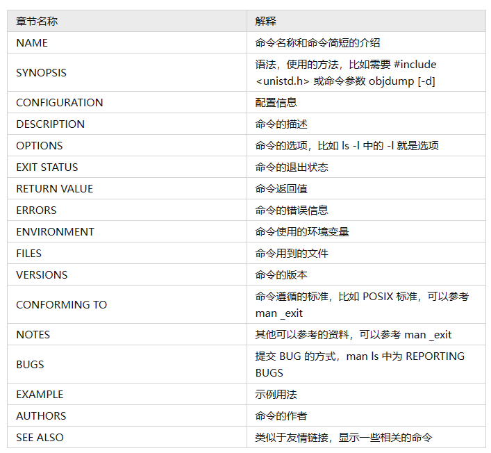

# Shell

## Shell可以敲命令
shell是壳，对应的是内核kernel。用户和内核之间的交互是通过shell。
直观上来看shell是一个黑框，在里面可以输命令

### shell命令的分类
- 可执行程序   ---shell程序调用系统里的其他软件
- shell内建命令---shell程序自己内置的
- shell函数（脚本的内容）---source过的脚本
- 别名-----------------为一个命令起一个别名

`type -a command` 显示命令类型

- type gcc --- gcc是/usr/bin/gcc
- type cd --- cd是 shell 的build in（内建）命令
- type mcd --- mcd是函数 
- type ls --- ls是 `ls --color=auto`的别名

`which command` 显示当前使用程序的具体位置
`help command` 显示build内建命令的手册

## shell可以看手册--man/TLDR 

### shell命令的执行方式
分号代表顺序执行
&&  前面的成功($?为0)才执行后面
||      前面的成功则不执行后面
把输出值存储到变量
后缀& 后台执行
{ 命令···;   }组命令在shell内执行，不产生新的进程
(命令···;   )组命令在独立建立的shell子进程内执行